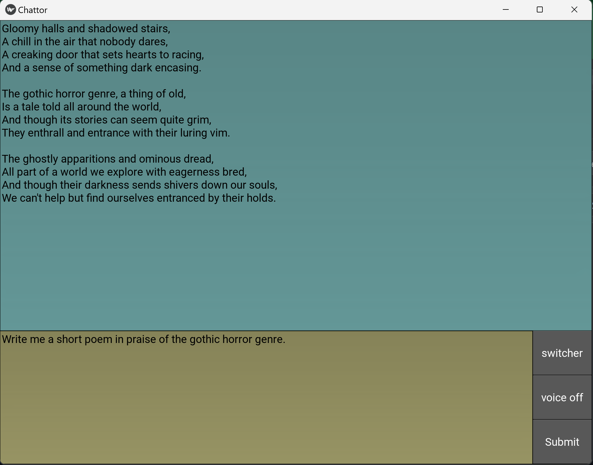

# Entourage 🎭

A sophisticated AI chat companion with character voices, session management, and educational features. Built for cross-platform deployment with a focus on voice interaction and character-based learning.

<p align="center">
  
</p>

## ✨ Features

### 🎯 **Core Chat Experience**
- **GPT-4 Mini Integration**: Powered by OpenAI's latest model for intelligent conversations
- **Real-time Streaming**: Watch AI responses appear in real-time as they're generated
- **Session Management**: Create unlimited chat sessions with different personas and contexts
- **Conversation History**: Automatic saving and restoration of all conversations
- **Smart Context**: Each session maintains its own conversation memory and settings

### 🎭 **Character Voice System**
- **ElevenLabs Integration**: Premium AI voice synthesis with character personalities
- **Character Voices**: Choose from wizards, robots, fairies, and more for engaging conversations
- **Voice Effects**: Real-time control over emotion, speed, and style
- **Per-Session Voices**: Each session can have its own unique character voice
- **Educational Characters**: Perfect for teaching kids about AI and different personas

### 🎤 **Advanced Voice Features**
- **Voice Input**: Speak naturally using OpenAI Whisper transcription
- **Push-to-Talk**: Simple voice input with visual feedback
- **Voice Output**: High-quality speech synthesis with character personalities
- **Automatic Summarization**: Long responses are intelligently summarized for voice output

### ⚙️ **Customization & Control**
- **Per-Session System Prompts**: Customize AI behavior for different use cases
- **Voice Manipulation**: Adjust emotion, speed, and style in real-time
- **Session-Specific Settings**: Each session remembers its voice and prompt settings
- **Visual Themes**: Clean, modern interface with accessibility in mind

## 🎯 **Perfect for Education**

Entourage is designed with educational use in mind, especially for teaching children about AI:

- **Character-Based Learning**: Different AI personalities for different subjects
- **Prompt Engineering**: Learn how different prompts create different AI behaviors
- **Voice Experimentation**: Understand how voice affects communication
- **Safe Environment**: Controlled, educational AI interactions

## 🚀 **Quick Start**

### Prerequisites

- **Python 3.7+**
- **OpenAI API Key** (for GPT-4 and Whisper)
- **ElevenLabs API Key** (for character voices, free tier available)
- **System Audio** (PortAudio and FFmpeg)

### System Dependencies

**Ubuntu/Debian:**
```bash
sudo apt update
sudo apt install ffmpeg libportaudio2 libportaudiocpp0 portaudio19-dev python3-dev
```

**macOS:**
```bash
brew install ffmpeg portaudio
```

**Windows:**
- Install FFmpeg from https://ffmpeg.org/
- Install Microsoft Visual C++ Build Tools

### Installation

1. **Clone and Setup:**
   ```bash
   git clone https://github.com/richarddun/entourage.git
   cd entourage
   python3 -m venv .venv
   source .venv/bin/activate  # On Windows: .venv\Scripts\activate
   ```

2. **Install Dependencies:**
   ```bash
   pip install -r requirements.txt
   ```

3. **Configure API Keys:**
   ```bash
   cp .env.example .env
   # Edit .env and add your API keys:
   # OPENAI_API_KEY=your_openai_key_here
   # ELEVENLABS_API_KEY=your_elevenlabs_key_here
   ```

4. **Run Entourage:**
   ```bash
   python main_app.py
   ```

## 🎭 **Character Voices**

### Regular Voices
- **Rachel** - Friendly, popular female voice (default)
- **Adam** - Confident, professional male voice
- **Matilda** - Warm, engaging female voice
- **Ana** - Expressive British female voice

### Character Voices
- **🧙‍♂️ Old Wizard** - Wise magical mentor for fantasy learning
- **🤖 Android X.Y.Z.** - Futuristic AI robot for tech topics
- **🧚‍♀️ Seer Morganna** - Mystical fortune teller for creative stories
- **🎪 Timmy Medieval** - Young energetic character for history
- **🐭 Michael Mouse** - Comic character for humor and entertainment
- **👹 Evil Witch** - Villain voice for storytelling contrast
- **🌟 Kawaii Aerisita** - Adorable anime-style for younger audiences
- **😂 Lutz Laugh** - Giggly character for comedic interactions

## 📚 **Educational Use Cases**

### Subject-Specific Sessions
```
"Math Tutor" → Rachel voice → "You are a patient math tutor..."
"History Guide" → 🧙‍♂️ Wizard → "You are Merlin, teaching history through magical stories..."
"Science Lab" → 🤖 Android → "You are a friendly AI scientist explaining concepts..."
"Creative Writing" → 🧚‍♀️ Morganna → "You help craft engaging stories and characters..."
```

### Voice Effects for Learning
- **Slow + Emotional**: Perfect for dramatic storytelling
- **Fast + Stable**: Great for quick facts and reviews  
- **High Style**: Exaggerated character voices for engagement
- **Natural Style**: Normal conversation mode

## ⚙️ **Configuration**

### Session Management
- Create unlimited sessions with unique names
- Each session maintains its own:
  - Conversation history
  - System prompt (AI personality)
  - Voice character and effects
  - Voice manipulation settings

### Voice Settings
- **Emotion Slider**: Control emotional range vs consistency
- **Speed Control**: Adjust speaking pace (0.7x to 1.2x)
- **Style Enhancement**: Natural to highly stylized character voices

### System Prompts
Customize AI behavior per session:
```json
{
  "Creative Writer": "You are an imaginative storyteller who helps craft engaging narratives...",
  "Code Reviewer": "You are a senior software engineer who provides detailed code reviews...",
  "Language Tutor": "You are a patient language teacher who explains grammar clearly..."
}
```

## 📱 **Mobile Ready**

Built with Kivy for cross-platform deployment:
- **Android**: Package with Buildozer for APK distribution
- **Touch Optimized**: All controls work well on tablets and phones  
- **Offline Sessions**: Conversation history stored locally
- **Cloud Sync**: All AI processing happens in the cloud

## 🛠️ **Technical Architecture**

### Core Technologies
- **Frontend**: Kivy (Python) - Cross-platform UI framework
- **AI**: OpenAI GPT-4 Mini with streaming responses
- **Voice Input**: OpenAI Whisper for speech-to-text
- **Voice Output**: ElevenLabs for premium AI voice synthesis
- **Audio**: PyAudio + pydub for real-time audio processing

### Key Features
- **Streaming Responses**: Real-time text generation with immediate voice cutover
- **Session Persistence**: JSON-based storage for conversations and settings
- **Voice Manipulation**: Real-time control of voice characteristics
- **Error Handling**: Graceful fallbacks and user-friendly error messages

## 🔧 **Troubleshooting**

### Common Issues

**No Voice Output:**
- Verify ElevenLabs API key is valid and has credits
- Check internet connection
- Ensure audio system is working

**Voice Input Not Working:**
- Test microphone permissions
- Check PortAudio installation
- Verify OpenAI Whisper API access

**Character Names Show as "Assistant":**
- Restart app to reload session settings
- Check that session voice settings are saved properly

### System-Specific

**Linux Audio Issues:**
```bash
# Install additional ALSA libraries if needed
sudo apt install libasound2-dev
```

**Windows PyAudio:**
```bash
# May need Microsoft Visual C++ 14.0
pip install pipwin
pipwin install pyaudio
```

## 🚀 **Roadmap**

### Near Term
- [ ] Android APK packaging with Buildozer
- [ ] More character voices and personalities
- [ ] Voice cloning for custom characters
- [ ] Conversation export formats (PDF, HTML)

### Future Features
- [ ] Multi-language character voices
- [ ] Screen sharing for visual learning
- [ ] Plugin system for custom characters
- [ ] Collaborative sessions (multiple users)
- [ ] Learning progress tracking

## 🤝 **Contributing**

We welcome contributions! Areas of focus:

- **Character Development**: New voice personas and educational characters
- **Mobile Optimization**: Android/iOS specific improvements
- **Educational Features**: Learning progress, parental controls
- **Voice Quality**: Enhanced voice effects and manipulation
- **Documentation**: Tutorials, guides, and examples

### Development Setup
```bash
git clone https://github.com/richarddun/entourage.git
cd entourage
python3 -m venv .venv
source .venv/bin/activate
pip install -r requirements-dev.txt
python main_app.py
```

## 📄 **License**

This project is licensed under the MIT License - see the [LICENSE](LICENSE) file for details.

## 🙏 **Acknowledgments**

- **OpenAI** - GPT-4, Whisper, and the foundation of modern AI
- **ElevenLabs** - Revolutionary AI voice synthesis technology
- **Kivy** - Enabling truly cross-platform Python applications
- **Community** - Voice actors and character designers who inspire our personas

## 💡 **Support**

- **Issues**: Report bugs and request features on GitHub
- **Discord**: Join our community for support and discussion
- **Documentation**: Full guides at [docs.entourage.ai](https://docs.entourage.ai)
- **Educational Resources**: Teaching guides and lesson plans available

---

**Transform learning with AI conversations. Give every subject its own voice.** 🎭✨